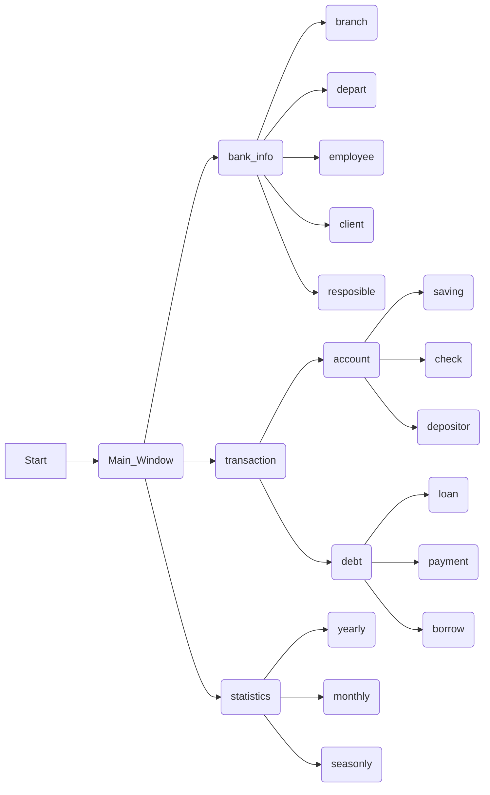

# 数据库系统实验之银行业务管理系统

## 姓名：刘文勋 学号：PB17111634

## 1 概述

### 1.1 系统目标

开发一个银行业务管理系统，使用数据库作为后台的数据存储，使用图形界面操作。其他更加具体的需求见下面的需求说明。

### 1.2.1 需求说明

```
1. 银行有多个支行。各个支行位于某个城市,每个支行有唯一的名字。银行要监控每个支行的资产。 

2. 银行的客户通过其身份证号来标识。银行存储每个客户的姓名、联系电话以及家庭住址。为了安全起见,银行还要求客户提供一位联系人的信息,包括联系人姓名、手机号、Email 以及与客户的关系。客户可以有帐户,并且可以贷款。客户可能和某个银行员工发生联系,该员工是此客户的贷款负责人或银行帐户负责人。

3. 银行员工也通过身份证号来标识。员工分为部门经理和普通员工,每个部门经理都负责领导其所在部门的员工,并且每个员工只允许在一个部门内工作。每个支行的管理机构存储每个员工的姓名、电话号码、家庭地址及部门经理的身份证号。银行还需知道每个员工开始工作的日期,由此日期可以推知员工的雇佣期。

4. 银行提供两类帐户——储蓄帐户和支票帐户。帐户可以由多个客户所共有,一个客户也可开设多个账户,但在一个支行内最多只能开设一个储蓄账户和一个支票账户。每个帐户被赋以唯一的帐户号。银行记录每个帐户的余额、开户日期、开户的支行名以及每个帐户所有者访问该帐户的最近日期。另外,每个储蓄帐户有利率和货币类型,且每个支票帐户有透支额。 

5. 每笔贷款由某个分支机构发放,能被一个或多个客户所共有。每笔贷款用唯一的贷款号标识。银行需要知道每笔贷款所贷金额以及逐次支付的情况(银行将贷款分几次付给客户)。虽然贷款号不能唯一标识银行所有为贷款所付的款项,但可以唯一标识为某贷款所付的款项。对每次的付款需要记录日期和金额。
```

### 1.2.2 功能说明

```
1. 客户管理：提供客户所有信息的增、删、改、查功能； 如果客户存在着关联账户或者贷
款记录，则不允许删除；

2. 账户管理：提供账户开户、销户、修改、查询功能，包括储蓄账户和支票账户； 账户号
不允许修改；

3. 贷款管理：提供贷款信息的增、删、查功能，提供贷款发放功能； 贷款信息一旦添加成
功后不允许修改； 要求能查询每笔贷款的当前状态（未开始发放、发放中、已全部发
放） ； 处于发放中状态的贷款记录不允许删除；

4. 业务统计：按业务分类（储蓄、 贷款）和时间（月、 季、 年）统计各个支行的业务总金
额和用户数， 要求对统计结果同时提供表格和曲线图两种可视化展示方式。
```

### 本报告的主要贡献

先陈述需求，然后详细描述总体设计，之后简要说明实现结果和测试结果，最后是这个实验的总结

## 2.总体设计

### 2.1系统模块结构

```
main.py：程序的入口，作为主窗口添加其他功能；

login.py:   登录入口，从助教的demo继承而来，但实际上未用上，因为每个功能都需要再进行数据库的接入；

branch.py：记录每个分行的信息：为了方便测试里只用了两个分行：合肥支行和南京支行；

employee.py：记录每个员工的信息；

customer.py：记录每个用户的信息；

depart.py：记录每个部门的信息，为了简化，这里只有两个部门：出纳部和账户部；

resposible.py：记录每个员工分管客户的信息；

saving.py：储蓄信息；

check.py：支票信息；

deposit.py：账户和客户的联系；

loan.py：贷款信息；

payment.py：客户还款信息；

borrow.py：借贷信息管理；

overall.py:	对年度进行业务统计；

month.py：对月度进行业务统计；

season.py：对季度进行统计。

```


### 2.2 系统工作流程




### 2.3 数据库设计

ER图和lab2类似：

**概念图**：


**物理图**：


**最终结构（sql）**：

```mysql
create database bank;
show databases;
use bank;
show tables;

drop table Employee;
drop table Branch;
drop table Depart;
drop table Customer;
drop table Responsible;
drop table Account;
drop table check_account;
drop table saving_account;
drop table depositor;
drop table loan;
drop table payment;
drop table borrow;


drop trigger insert_saving;
drop trigger insert_check;
drop trigger delete_saving;
drop trigger delete_check;
drop trigger add_payment;
drop trigger delete_payment;
drop trigger update_payment;
create table Employee
(
   `employee_id`        int               not null,
   `branch_name`        varchar(200)                 not null,
   `depart_id`			int,
   `name`               text,
   `address`            text,
   `phone`              text,
   `start_date`         text,
   constraint PK_EMPLOYEE primary key (employee_id),
   constraint FK_MANAGER_ID foreign key(depart_id)
			references Depart	(depart_id),
   constraint FK_EMPLOYEE_WORK_FOR_BRANCH foreign key (branch_name)
      references Branch (branch_name)
);
create table Branch
(
   `branch_name`        varchar(200)                 not null,
   `city`               text,
   `asset`              real,
   constraint PK_BRANCH primary key (branch_name)
);
create table Depart
(
	`depart_id`			int					not null,
    `depart_name`			text,
    `depart_type`			text,
    `manager_id`			int,
    constraint	PK_DEPART	primary key	(depart_id)
);
create table Customer
(
   customer_id        int               not null,
   name	              text,
   phone              text,
   address            text,
   contact_name       text,
   contact_phone      text,
   contact_email      text,
   contact_relation   text,
   constraint PK_CUSTOMER primary key (customer_id)
);
create table Responsible 
(
   employee_id        integer               not null,
   customer_id        integer               not null,
   type               text,
   constraint PK_RESPONSIBLE primary key (employee_id, customer_id),
   constraint FK_RESPONSI_RESPONSIB_EMPLOYEE foreign key (employee_id)
      references Employee (employee_id),
   constraint FK_RESPONSI_RESPONSIB_CUSTOMER foreign key (customer_id)
      references Customer (customer_id)
   
);
create table Account 
(
	Account_id         integer               not null,
	branch_name        varchar(200)                 not null,
   constraint PK_Account primary key (Account_id)
);
create table Check_Account 
(
   Account_id         integer               not null,
   branch_name        varchar(200)                not null,
   balance            real,
   open_date          text     ,
   overdraft          real,
   constraint PK_CHECK_ACCOUNT primary key (Account_id),
   constraint FK_CHECK_AC_Account_IN_Account foreign key (Account_id)
      references Account (Account_id),
   constraint FK_Check_ACCOUNT_OPEN_ACCO_BRANCH foreign key (branch_name)
      references Branch (branch_name)
);
create table Saving_Account 
(
   Account_id         integer               not null,
   branch_name        varchar(200)                 not null,
   balance            real,
   open_date          text,
   interest_rate      real,
   currency_type      text,
   constraint PK_SAVING_Account primary key (Account_id),
   constraint FK_SAVING_A_Account_IN_Account foreign key (Account_id)
      references Account (Account_id),
   constraint FK_Saving_ACCOUNT_OPEN_ACCO_BRANCH foreign key (branch_name)
      references Branch (branch_name)
);
create table depositor
(
   Account_id         integer               not null,
   customer_id        integer               not null,
   access_date        text,
   constraint PK_DEPOSITOR primary key (Account_id, customer_id),
   constraint FK_DEPOSITO_DEPOSITOR_Account foreign key (Account_id)
      references Account (Account_id),
   constraint FK_DEPOSITO_DEPOSITOR_CUSTOMER foreign key (customer_id)
      references Customer (customer_id)
);
create table Loan 
(
   loan_id            integer           not null,
   branch_name        varchar(200)                 not null,
   amount             real,
   total              real     default 0,
   state 			  int default 0,
   constraint PK_LOAN primary key (loan_id),
   constraint FK_LOAN_BRANCH_LO_BRANCH foreign key (branch_name)
      references Branch (branch_name)
);

create table Payment 
(
   loan_id            integer           not null,
   payment_id         integer               not null,
   payment_date       text,
   amount             real,
   constraint PK_PAYMENT primary key (loan_id, payment_id),
   constraint FK_PAYMENT_PAY_LOAN foreign key (loan_id)
      references Loan (loan_id)
);

create table borrow 
(
   customer_id        integer               not null,
   loan_id            integer           not null,
   constraint PK_BORROW primary key (customer_id, loan_id),
   constraint FK_BORROW_BORROW_CUSTOMER foreign key (customer_id)
      references Customer (customer_id),
   constraint FK_BORROW_BORROW2_LOAN foreign key (loan_id)
      references Loan (loan_id)
);

delimiter $$
create trigger insert_saving before insert on saving_account for each row
begin
insert into account(Account_id,branch_name)
	values (new.Account_id,new.branch_name);
end $$
delimiter ;
delimiter $$
create trigger insert_check before insert on check_account for each row
begin
insert into account(Account_id,branch_name)
	values (new.Account_id,new.branch_name);
end $$
delimiter ;

delimiter $$
create trigger delete_saving after delete on saving_account for each row
begin
delete from account 
	where Account_id=old.Account_id;
end $$
delimiter ;
delimiter $$
create trigger delete_check after delete on check_account for each row
begin
delete from account 
	where Account_id=old.Account_id;
end $$
delimiter ;
delimiter $$
create trigger add_payment after insert on payment for each row
begin
update loan 
   set total=total+new.amount
   where loan_id=new.loan_id;
update loan
	set state = 1
    where loan_id = new.loan_id and amount > total;
update loan 
	set state = 2 
    where loan_id = new.loan_id and amount = total;
end $$
delimiter ;
delimiter $$
create trigger delete_payment after delete on payment for each row
begin
update loan
	set total = total - old.amount
    where loan_id = old.loan_id;
update loan
	set state = 1
    where loan_id = old.loan_id and amount > total;
update loan 
	set state =0 
    where loan_id = old.loan_id and total = 0;
end $$
delimiter ;
delimiter $$
create trigger update_payment after update on payment for each row
begin
update loan
	set total = total + new.amount -old.amount 
	where loan_id = old.loan_id;
update loan
	set state = 1
    where loan_id = old.loan_id and amount > total;
update loan 
	set state = 2 
    where loan_id = old.loan_id and amount = total;
update loan 
	set state = 0
    where loan_id = old.loan_id and total = 0;
end $$
delimiter ;
```

补充说明：使用了几个触发器用来更新账户信息的贷款信息：即设定同一个人每次进行业务用的不是一个账户，但这些账户是归属于他的；更新贷款信息则是为了解决还款时造成的已还总额出现不一致性，同时对贷款的状态信息进行更新：0为未发放，1为发放中，2为发放完（这里我是根据还款来确定发放状态的：没还款则未发放，还完了则发放完了。因为需求并没有对这点进行详尽的说明）

##  3.详细设计

### 3.1 功能模块

#### 3.1.1.main

主要是pyqt的使用--把每个功能接到主界面上，这个并不是重点，且叙述起来过于冗杂。

关键代码：

```python
if __name__ == '__main__':
    app = QApplication(sys.argv)
    passdlg = Login()
    if(passdlg != None):
        window = Main_window()
        window.show()
    sys.exit(app.exec_())
```

#### 3.1.2.login

从上一个代码可以看到，对于login只是进行了一个实例化，并不意味着给后续模块开放了访问数据库权限，但是为了保持demo的代码的完整性我保留了下来

#### 3.1.3.branch

```python
    def __init__(self, *args, **kwargs):
        super(Branch, self).__init__(*args, **kwargs)
        self.setWindowTitle("Branch")
        #ui
        self.tableWidget = QTableView()

        self.db=QSqlDatabase.addDatabase('QMYSQL')
        self.db.setHostName("127.0.0.1")
        self.db.setPort(3306)
        self.db.setUserName("root")
        self.db.setPassword("l9254866486")
        self.db.setDatabaseName("bank")
        # print(QSqlDatabase.drivers())
        if self.db.open():
            print("ok")
        else:
            print(self.db.lastError().text())
```


这是每个模块的必须部分，从这里接入数据库

对于按钮的构建就不赘述

再说明增删查改的实现：

```python
self.model = QSqlRelationalTableModel()
```

先把数据库实例化成一个model

**查找**

```python
    def query_event(self):
        select_string=""
        if self.branch_name_edit.text()!="":
            select_string+="branch_name="+"'"+self.branch_name_edit.text()+"'"
        
        if self.city_edit.text()!="":
            if select_string!="":
                select_string+=" and city="+"'"+self.city_edit.text()+"'"
            else:
                select_string+="city="+"'"+self.city_edit.text()+"'"
        
        if self.assetL_edit.text()!="":
            if select_string!="":
                select_string+=" and asset >= "+self.assetL_edit.text()
            else:
                select_string+="asset >= "+self.assetL_edit.text()
        
        if self.assetU_edit.text()!="":
            if select_string!="":
                select_string+=" and asset <= "+self.assetU_edit.text()
            else:
                select_string+="asset <= "+self.assetU_edit.text()
        print(select_string)
        self.model.setFilter(select_string)
        self.model.select()
```

随后根据输入框的内容拼接成``select``语句中``where``的子句内容，最后把这个子句直接传入``setFilter``里，执行``select``把数据传入到表格中

**更新**

```python
    def update_event(self):
        if self.tableWidget.currentIndex().row() > -1:
            record=self.model.record(self.tableWidget.currentIndex().row())
            record.setValue("branch_name",self.branch_name_edit.text())
            record.setValue("city",self.city_edit.text())
            record.setValue("asset",self.assetL_edit.text())
            if not self.model.setRecord(self.tableWidget.currentIndex().row(),record):
                QMessageBox.warning(QMessageBox(), 'Error', self.model.lastError().text())
        else:
            QMessageBox.question(self,'Message', "Please select a row would you like to update.", QMessageBox.Ok)
            self.show()
        self.model.select()
```

先用``currentIndex().row()``找到选定的行，然后对该行的值进行替换，最后``SetRecord``直接更新

**增**

```python
    def add_event(self):
        row=self.model.rowCount()
        self.model.insertRows(row,1)
        self.model.setData(self.model.index(row,0),self.branch_name_edit.text())
        self.model.setData(self.model.index(row,1),self.city_edit.text())
        self.model.setData(self.model.index(row,2),self.assetL_edit.text())
        if not self.model.submitAll():
            QMessageBox.warning(QMessageBox(), 'Error', self.model.lastError().text())
        self.model.select()
```

选择在最下面进行增加，`setData`进行赋值，`submitAll()`把数据提交到数据库

**删**

```python
    def delete_event(self):
        if self.tableWidget.currentIndex().row() > -1:
            if not self.model.removeRow(self.tableWidget.currentIndex().row()):
                QMessageBox.warning(QMessageBox(), 'Error', self.model.lastError().text())
            self.model.select()
        else:
            QMessageBox.question(self,'Message', "Please select a row would you like to delete", QMessageBox.Ok)
            self.show()
```

和更新操作类似，同样是指定行，然后使用`removeRow`把该行从数据库删除

**其他数据库非统计功能模块与之类似，均为实例化model，随后添加增删查改的功能，故不再赘述**

### 3.2. 统计模块

分为年月季，且年和季的业务统计是以月统计的基础写的，因此这里只讲月，顺带讲一下年的季的不同处理

##### 需求分析

根据文档，统计结果为每个支行储蓄和贷款的总金额数和用户数，因此显示四个情况共八个图：储蓄的每月总金额曲线图及表格；储蓄的每月客户数曲线图及表格；贷款的每月总金额数及表格；贷款的每月客户数及表格。

##### 代码

这里用到了pandas和pymysql两个额外的包，用来链接数据库和从数据库里读取数据。

**贷款部分**：

```python
dbconn=pymysql.connect(
      host="127.0.0.1",
      database="bank",
      user="root",
      password="root",
      port=3306
     ) #连接数据库
```

```python
month = []
    print(month)
    temp = []
    temp1 = []
    for i in range(12):
      point = [i+1, 0]
      temp.append(point)
      temp1.append(point)
    month.insert(0,temp)
    month.insert(1,temp1)# 默认为两个支行，对两个支行每个月的初值赋为0
```

```python
    dict = {
      "合肥支行":0,
      "南京支行":1
    }
    for i,s in enumerate(["01", "02", "03", "04", "05", "06", "07", "08", "09", "10", "11", "12"]):
      sqlcmd="select branch_name,sum(payment.amount) from payment,loan \
                  where payment.loan_id=loan.loan_id and payment_date like '2020-{}%' group by branch_name;".format(s)# 所要执行的mysql语句，选择每个月的支付总额，且按支行名分类
      #利用pandas 模块导入mysql数据
      a=pd.read_sql(sqlcmd,dbconn)
      # if not a.values.any() :
      #   print("1")
      #取前5行数据
      # b=a.head()
      # print(a.values)
      if a.values.any():
        for data in a.values:
          # print(dict[data[0]])
          # print(month[dict[data[0]]][i][1])
          # print(month[dict[data[0]]])
          month[dict[data[0]]][i] = [i+1,data[1]]# 修改对应支行对应的月份总额
          # print(month)
```

```python
	series = []  # 实现曲线图图形化，后面不再赘述
    for i in range(len(month)):
      series_here = QLineSeries()#实例化曲线
      point_list = []
      for item in month[i]:
        point = QPointF(item[0],item[1])#为曲线添加点
        point_list.append(point)
      print(point_list)
      series_here.append(point_list)
      series_here.setName(list(dict.keys())[i])#为曲线设置名字
      series.append(series_here)#曲线组成列表

    x_Aix = QValueAxis()  # 定义x轴，实例化
    x_Aix.setRange(1.00, 12.00)  # 设置量程
    x_Aix.setLabelFormat("%d")  # 设置坐标轴坐标显示方式，精确到小数点后两位
    x_Aix.setTickType(QValueAxis.TicksFixed)
    x_Aix.setTickCount(11)  # 设置x轴有几个量程
    x_Aix.setMinorTickCount(1)  # 设置每个单元格有几个小的分级

    y_Aix = QValueAxis()  # 定义y轴
    y_Aix.setRange(0.00, 200)
    y_Aix.setLabelFormat("%d")
    y_Aix.setTickType(QValueAxis.TicksFixed)
    y_Aix.setTickCount(20)
    y_Aix.setMinorTickCount(10)

    charView = QChartView()  # 定义charView，父窗体类型为 Window
    charView.setGeometry(0, 0, 800, 600)  # 设置charView位置、大小
    # charView.resize(800, 600)
    charView.setRenderHint(QPainter.Antialiasing)  # 抗锯齿

    charView.chart().addSeries(series[0])  # 添加折线
    charView.chart().addSeries(series[1])  # 添加折线

    charView.chart().setAxisX(x_Aix, series[0])  # 设置x轴属性
    charView.chart().setAxisX(x_Aix, series[1])
    charView.chart().setAxisY(y_Aix, series[0])  # 设置y轴属性
    charView.chart().setAxisY(y_Aix, series[1])
    charView.chart().createDefaultAxes() # 使用默认坐标系
    # charView.chart().setTitleBrush(QBrush(Qt.cyan))  # 设置标题笔刷
    charView.chart().setTitle("偿还贷款")  # 设置标题
```

````python
	tableWidget = QTableWidget()  # 创建一个表格

    tableWidget.setRowCount(12)
    tableWidget.setColumnCount(2)  # 12行2列

    tableWidget.setHorizontalHeaderLabels(['合肥支行', '南京支行'])
    tableWidget.setVerticalHeaderLabels(['1', '2', '3', '4', '5','6','7','8','9','10','11','12'])
    for i in range(12):
      print(month[0][i][1])
      tableWidget.setItem(i, 0, QTableWidgetItem(str(month[0][i][1]))) # 显示值
      tableWidget.setItem(i, 1, QTableWidgetItem(str(month[1][i][1])))
````

**对于用户和储蓄部分而言，模板是一样的，只是执行的`mysql`语句不一样，以及对x，y轴的量程设置不一样**：

```python
"select branch_name,count(borrow.customer_id) from payment,borrow,loan \
            where borrow.loan_id=loan.loan_id and payment.loan_id = loan.loan_id and payment.payment_date like '2020-{}%' group by branch_name;".format(
        s) # 贷款人数

"select branch_name,sum(balance) from saving_account where open_date like '2020-{}%' group by branch_name;".format(
        s) # 储蓄总金额

"select branch_name,count(depositor.customer_id) from depositor,saving_account \
                where depositor.account_id =saving_account.account_id and saving_account.open_date like '2020-{}%' group by branch_name;".format(
        s) #储蓄人数
```

**年统计区别**：

```python
    for i,s in enumerate(["2009", "2010", "2011", "2012", "2013", "2014", "2015", "2016", "2017", "2018", "2019", "2020"]):
      sqlcmd="select branch_name,sum(payment.amount) from payment,loan \
                  where payment.loan_id=loan.loan_id and payment_date like '{}-%' group by branch_name;".format(s) #实际和月一样，不过enumerate的表元素换成了年份，查找的限定也成了年份

```

**季度区别**

```python
    for i,s in enumerate([("01",  "03"), ("04", "06"), ("07", "09"),("10", "12")]):
      sqlcmd="select branch_name,sum(payment.amount) from payment,loan \
                  where payment.loan_id=loan.loan_id and payment_date >= '2020-%s 'and payment_date <= '2020-%s' group by branch_name;"% (
                s[0], s[1])# 对一个季度内的总金额进行求和计算
```

## 4.实现与测试

**说明**：这里账户部管储蓄和支票，贷款部管放贷和还贷

### 4.1 实现结果


看起来都挺对的

### 4.2 测试效果

限于篇幅只展现`branch`和贷款时`total`和`state`的变化：

**增**：


**删**：


**查**：


**改**：


**loan的total和state变化**：


可以看到total变成了1，state变成了1(发放中)


可以看到total变成了688，state变成了2(已发放完)


再加一次，则


随后会退出，update和delete有类似的效果

## 5.总结与讨论

### 踩坑

pyqt5缺少qsqlmysql.dll和libmysql.dll

且在windows下，未连接到数据库是不会被自动的报错的，最后是把pyqt5回退至5.12.1版本再把python自带的libmysql.dll添加到qt库里解决的

### 错误处理

对贷款总额使用触发器进行更新，且对于溢出情况(更新，添加，删除时)会有一个错误提示和`exit（）`

下面只展示`update`操作的错误处理

```python
            query = QSqlQuery()
            query.exec("select amount,total from loan where loan_id =" + self.loan_id_edit.text()+";") # loan内查找贷款信息
            query_update = QSqlQuery()
            query_update.exec("select amount from payment where loan_id = {} and payment_id = {};".format(self.loan_id_edit.text(),self.payment_id_edit.text())) #payment里查找这一条付款记录的old信息
            amount = 0
            pay_amount = 0
            total = 0
            # print(query_update)
            while query_update.next():
                pay_amount = query_update.value(0)
                print(pay_amount)
            while query.next():
                amount = query.value(0)
                total = query.value(1)
                print(amount,total)
            if amount < (total+float(self.amountL_edit.text())-pay_amount):# 计算比较
                messagebox.showerror("error","修改后的还款总额多于借款") #错误提示
                os.system("pause")
                exit()
```

**处于发放中状态的贷款记录不允许删除：**

这个问题并没有被完好的解决：未开始发放的贷款必能被删除，同时发放中的和已全部发放的贷款不能被删除，因为我在payment表里把loan表里的loan_id作为外键了

**姓名单引号问题在这里似乎不是问题**：

因为主键是客户的id

### 工作反思

每个功能实际上是差不多的，所以倒过来想，应该例化出一个公有class，然后每个模块对这个class上进行继承，而不是把一个功能来来回回复制粘贴，这样导致在debug的时候很晕，所以软件开发的前期一定要先做好设计这也算是软件开发的一个经验了。


